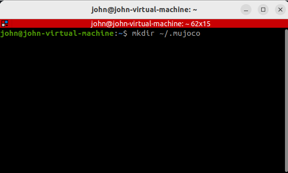

# OPENAI_MUJOCO_PROJECT
 Introduction to Artificial Intelligence Course Big Assignment 2

## Installation (Mujoco)

Prerequisites:
  Linux with Python 3.6+
- Go to this site and install the source code (tar.gz)
https://github.com/openai/mujoco-py/releases/tag/v2.1.2.14

- Once you installed the tar.gz file, extract it and open it on any code editor (Visual Studio Code in my case)
- Navigate to the README.md file and follow the instructions to installing MoJoCo

### Following the README.md file
- Download the Linux version of MuJoCo 2.1 binaries from this link: https://mujoco.org/download/mujoco210-linux-x86_64.tar.gz
- Extract the downloaded 'mujoco210' directory into "~\/.mujoco" (without the quotation marks)

### How to extract the `mujoco210-linux-x86_64.tar.gz` file and create the directory

Step 1


Step 2

Step 3

Step 4

Step 5

Step 6

Step 7


## Common errors and solutions:

### Error: Adding LD_LIBRARY_PATH to .bashrc file

Solution:
1. Navigate to the .bashrc file in your home directory 


1. Edit the .bashrc file and paste the following text at the bottom of the text file and save it (don't forget to change "user" to your home directory's username):
``` 
export LD_LIBRARY_PATH="/home/user/.mujoco/mujoco210/bin:$LD_LIBRARY_PATH"
```
### Ubuntu installation troubleshooting

To install mujoco-py on Ubuntu, make sure you have the following libraries installed:

    sudo apt install libosmesa6-dev libgl1-mesa-glx libglfw3

## Testing mujoco-py 
To play with `mujoco-py` interactively, follow these steps:

1. Type the following command in your text editor terminal:
``` 
$ pip3 install -U 'mujoco-py<2.2,>=2.1'
```

2. Create a new python file inside the project and name it `test_mujoco.py` then paste the following code:
```
import mujoco_py
import os
mj_path = mujoco_py.utils.discover_mujoco()
xml_path = os.path.join(mj_path, 'model', 'humanoid.xml')
model = mujoco_py.load_model_from_path(xml_path)
sim = mujoco_py.MjSim(model)

print(sim.data.qpos)
# [0. 0. 0. 0. 0. 0. 0. 0. 0. 0. 0. 0. 0. 0. 0. 0. 0. 0. 0. 0. 0.]

sim.step()
print(sim.data.qpos)
# [-2.09531783e-19  2.72130735e-05  6.14480786e-22 -3.45474715e-06
#   7.42993721e-06 -1.40711141e-04 -3.04253586e-04 -2.07559344e-04
#   8.50646247e-05 -3.45474715e-06  7.42993721e-06 -1.40711141e-04
#  -3.04253586e-04 -2.07559344e-04 -8.50646247e-05  1.11317030e-04
#  -7.03465386e-05 -2.22862221e-05 -1.11317030e-04  7.03465386e-05
#  -2.22862221e-05]
```
3. Run the code and check if it displays the expected output. If it does, then that means you have sucessfully installed `mujoco-py`. Congrats. 
4. Now you can also test the other examples in the "examples" folder of the `MUJUCO-PY-2.1.2.14` project. 